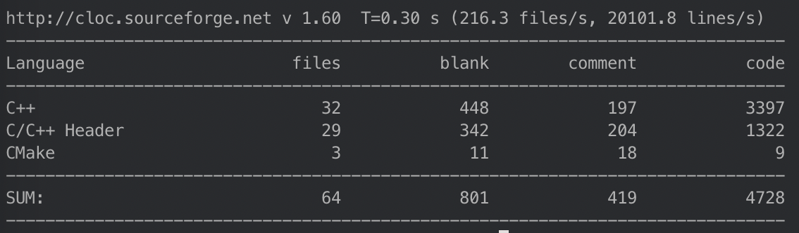

# Glacier

[](https://opensource.org/licenses/MIT)

本项目是使用C++11编写的高性能Web服务器，名字叫Glacier，译为冰川。希望它能像冰川一样的稳定。写这个项的目的是为了更好的理解C++多线程编程，夯实基础，掌握技巧，提升自己。

网络编程的核心操作是 server 会 listen 在某个端口，调用 accept 等待客户的 connect ，等客户连接上时会返回一个 fd (file descriptor) ，从 fd 里 read，然后重新 accept 。`echoserv` 和 `csapp` 两个文件中包含了两个 Tcp echo 服务器的例子。虽然他们能正常的工作，但是完全不能投入工业使用，因为他们是单线程的程序，也就是说同一时刻只能满足一个用户的请求。

所以，高效的多线程编程是十分值得我们学习的，也可以为我们进入工业界打下良好的基础。

## 目录

* [如何使用](#如何使用)
* [设计介绍](#设计介绍)
* [Webbench压测](#Webbench压测)
* [代码量统计](#代码量统计)
* [日志库介绍](./base)

## 如何使用

```shell
git clone git@github.com:iceice/glacier.git

cd glacier

./build.sh

cd build/release-cpp11/bin

./glacier [-t thread_numbers] [-p port]
```

## 设计介绍

最原始的网络编程思路就是服务器用一个 while 循环，不断监听端口是否有新的套接字连接，如果有，那么就调用一个处理函数处理。这种方法的最大问题是无法并发，效率太低，如果当前的请求没有处理完，那么后面的请求只能被阻塞，服务器的吞吐量太低。

接下来，就想到了使用多线程，也就是很经典的 connection per thread，每一个连接用一个线程处理。虽然这种做法一定程度上提高了服务器的吞吐量，但是对于系统资源的要求太高，系统中创建线程是需要比较高的系统资源的，如果连接数太高，系统无法承受，而且，线程的反复创建/销毁也需要代价。

最优的做法就是采用**基于事件驱动**的设计，当有事件触发时，才会调用处理器进行数据处理。即 Reactor 模式 (non-blocking IO + IO multiplexing)，使用非阻塞IO和IO多路复用技术来处理并发。程序的基本结构是一个事件循环，以事件驱动和事件回调的方式实现业务逻辑。为避免线程频繁创建和销毁带来的开销，使用线程池在程序的开始创建固定数量的线程。

Glacier 的 Reactor 核心参考了 muduo 进行设计，主要核心类有：Channel、EventLoop、Epoll、TimerQueue

### Channel

Channel 类比较简单，负责IO事件分发，每一个 Channel 对象管理一个文件描述符 fd，但是并不拥有这个文件描述符，所以不会再析构的时候去关闭 fd，它的核心成员如下：

```c++
EventLoop *loop_; // channel所属的loop
const int fd_;    // channel负责的文件描述符
int events_;      // 注册的事件
int revents_;     // poller设置的就绪的事件
int index_;       // channel在epoll中的状态：kNew/kAdded/kDeleted

ReadEventCallback readCallback_; // 读事件回调
EventCallback writeCallback_;    // 写事件回调
EventCallback closeCallback_;    // 关闭事件回调
EventCallback errorCallback_;    // 错误事件回调
```

每个 channel 对象自始至终只属于一个 EventLoop，即只属于一个 IO线程。每当它负责的文件描述符 fd 有了新的动作之后，Epoll 会改变 revents_ 的值，根据这个值 `handleEvent` 函数会调用上面四个回调函数中的一个。几个 callback 函数都是 c++11 里面的 function 对象。

Channel 的生命周期由其 owner 负责。

### Epoll

Epoll 类是对 `<sys/epoll.h>` 的封装，它的核心成员如下：

```c++
typedef std::vector<struct epoll_event> EventList;
typedef std::map<int, Channel *> ChannelMap;

EventLoop *ownerLoop_; // 每个Epoll属于一个IO线程
int epollfd_;          // epool的文件描述符
EventList events_;     // 存储epoll_wait返回的事件
ChannelMap channels_;  // fd ==> channel的映射
```

ChannelMap 是文件描述符 fd 和它所属的 channel 的映射。EventList 保存了每一个 fd 关心的事件。Channel 类中的 index_ 对应的就是 fd 在 EventList 中的下标。

Epoll 类的核心函数如下：

```c++
public:
    Timestamp poll(int timeoutMs, ChannelList *activeChannels);
    void updateChannel(Channel *channel);
    void removeChannel(Channel *channel);
private:
	void fillActiveChannels(int numEvents, ChannelList *activeChannels) const;
```

updateChannel 和 removeChannel 通过调用 `::epoll_ctl` 将 channel 管理的文件描述符告诉 epoll。

poll 函数是对 ::epoll_wait 的封装，状态改变的 event 将存放在 events_ 中。

私有的 fillActiveChannels 函数负责把返回的活动时间添加到 activeChannels 中。

Poller 的生命周期和 EventLoop 一样长。

### EventLoop

EventLoop类是核心，每个线程只能拥有一个 EventLoop 对象。并且为了线程安全，在设计 EventLoop 的成员函数的时候，必须考虑哪些函数只能被IO线程 (EventLoop所属线程) 调用，哪些成员函数可以跨线程调用。在 EventLoop 的构造函数中，赋值 `threadId_` ，所以就可以通过下面这个函数来判断当前线程是否为IO线程。

```c++
bool isInLoopThread() const { return threadId_ == CurrentThread::tid(); }
```

IO线程可能一直阻塞在 `loop()` 函数中，为了避免长时间的阻塞，方便线程间的任务调配。需要一种方法唤醒当前IO线程，并且让它执行某个回调函数。传统的方法是使用 pipe，IO线程始终监视此管道的 readable 事件，在需要唤醒的时候，其他线程往管道里写一个字节，唤醒IO线程。但是这种办法存在一定的缺陷，由于 pipe 是半双工的传统 IPC 方式，所以两个线程通信需要两个 pipe 文件，文件描述符可是系统中非常宝贵的资源，linux的默认值也只有1024而已。另外一点是 pipe 是点对点的，不能做到一对多。

为了解决这些缺点，可以使用 eventfd 结合 epoll 来进行线程间的通信。但我们需要唤醒IO线程的时候，只需要向eventfd 写入 8 字节的数据即可唤醒它。这个方法只需要打开一个文件描述符，并且可以做到广播的通知效果。另外我们的IO线程本身就阻塞在了 epoll 的调用上，而 eventfd 完美的与 epoll 结合，让IO线程脱离阻塞。

我们来看一下 EventLoop 的核心成员：

```c++
Timestamp pollReturnTime_;               // poll有事件到来返回的时间
std::unique_ptr<Epoll> poller_;          // poll函数的具体调用者
std::unique_ptr<TimerQueue> timerQueue_; // 定时器队列

int wakeupFd_;                           // 唤醒fd
std::unique_ptr<Channel> wakeupChannel_; // 唤醒通道
ChannelList activeChannels_;             // 活跃的通道列表
Channel *currentActiveChannel_;          // 当前活跃的通道列表

mutable MutexLock mutex_;
std::vector<Functor> pendingFunctors_;   // 函数列表
```

其中 wakeupFd_ 对应的就是 eventfd，wakeupChannel_ 管理这个文件描述符被唤醒后的操作。在 EventLoop 初始化的时候，wakeupChannel_ 设置回调读状态的函数为 `handleRead`：

```c++
wakeupChannel_->setReadCallback(
	std::bind(&EventLoop::handleRead, this)); // 注册读完成时的回调函数
wakeupChannel_->enableReading();              // 永远从wakeupfd中读
```

最后，来看一下 EventLoop 最核心的函数 `loop()`：

```c++
while (!quit_)
{
    activeChannels_.clear(); // 清空事件列表
    // 通过poller获取就绪的channel，放到activeChannels_中
    pollReturnTime_ = poller_->poll(kPollTimeMs, &activeChannels_);
    ++iteration_;

    eventHandling_ = true;

    // 处理就绪事件
    for (Channel *channel : activeChannels_)
    {
        currentActiveChannel_ = channel;
        currentActiveChannel_->handleEvent(pollReturnTime_);
    }
    currentActiveChannel_ = NULL;
    eventHandling_ = false;
    doPendingFunctors();  // 处理一些其它的任务
}
```

### TimerQueue

传统的 Reactor 通过控制 select 和 poll 的等待时间来实现定时，而现在在 Linux 中有了 timerfd，我们可以用和处理IO事件相同的方式来处理定时，代码的一致性更好。

TimerQueue 需要高效的组织目前尚未到期的 Timer，能快速的根据当前时间找到已经到期的 Timer，也要能高效地添加和删除 Timer。这里，我使用 STL 的 set 来进行实现，它的底层是二叉搜索树，并且是有序的，并且支持指定元素的删除操作，事件复杂度为 $O(logn)$ 。它的主要数据成员如下：

```c++
// pair<Timestamp, Timer *>作为key
// 即使两个Timer的到期时间相同，它们的地址也必不同
typedef std::pair<Timestamp, Timer *> Entry;
typedef std::set<Entry> TimerList;
typedef std::pair<Timer *, int64_t> ActiveTimer;
typedef std::set<ActiveTimer> ActiveTimerSet;

EventLoop *loop_;             // 每个计时器队列属于一个IO线程
const int timerfd_;           // 用来唤醒
Channel timerfdChannel_;      // 处理回调函数

TimerList timers_;            // Timer队列，按照过期时间排序
ActiveTimerSet activeTimers_; // 有效的Timer队列
```

如果我们想要添加一个计时器，或者取消一个计时器，只需要操作 TimerList 即可。

## Webbench压测


QPS = 2652077 pages/min = 44201 pages/sec

## 代码量统计



