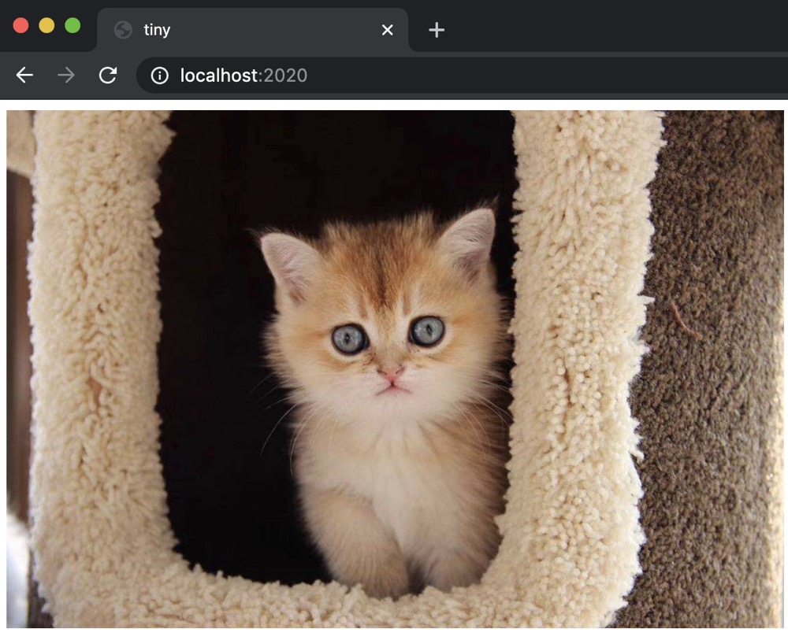

# Tiny Web Server
Tiny is an interesting program. It combines many of the ideas that we have learned about, such as process control, Unix I/O, the sockets interface, and HTTP, in only 250 lines of code. While it lacks the functionality, robustness, and security of a real server, it is powerful enough to serve both static and dynamic content to real Web browsers. We encourage you to study it and implement it yourself. It is quite exciting (even for the authors!) to point a real browser at your own server and watch it display a complicated Web page with text and graphics.

## How to use
```
make
make clean

./server <port> 
```

## Static
Open the browser and enter the web address `http://localhost:2020`

You will see:



## Dynamic
