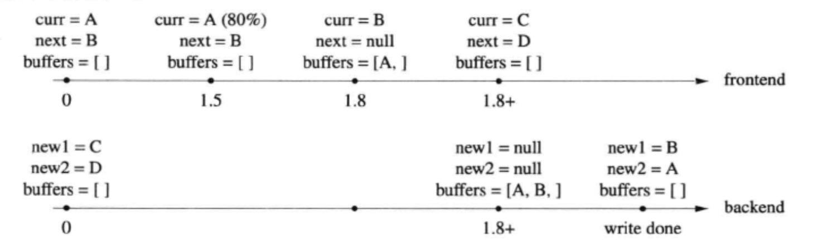

# C++高性能日志库

> 本项目仿照 muduo 的日志库进行编写

在服务端编程中，日志是必不可少的，在生产环境中应该做到 "Log Everything All The Time" 。一个日志库大体可分为前端 (frontend) 和后端 (backend) 两部分。前端是供应用程序使用的接口，并生成日志消息；后端则负责把日志消息写到目的地。

在多线程程序中，日志是一个典型的 **多生产者-单消费者问题** ，对于生产者 (前端) 来说，要尽量做到低延迟、低CPU开销、无阻塞；对于消费者 (后端) 来说，要做到足够大的吞吐量并占用较少的资源。每个业务线程都相当于一个前端，整个程序共用一个后端日志线程负责收集日志消息，并写入文件。其他业务线只管往这个 "日志线程" 发送日志消息，这称为 **异步日志 (非阻塞日志)**。

在多线程程序中，异步日志是必须的，因为如果在业务线程中直接往磁盘写数据的话，写操作偶尔可能阻塞长达数秒之久。这可能导致请求方超时或者耽误发送心跳消息。因此，在正常的实时业务处理流程中应该彻底避免磁盘IO，这在使用 "one loop per thread" 模型的非阻塞服务端程序中尤为重要，因为线程是复用的，阻塞线程意味着影响多个客户连接。

目录：

1. [LogStream](#LogStream)
2. [Logging](#Logging)
3. [LogFile](#LogFile)
4. [AsyncLogging](#AsyncLogging)
5. [性能调优总结](#性能调优总结)

## LogStream

没有使用标准库中的 `iostream`，而是自定义了一个 `LogStream` ，主要是出于性能的考虑。

### iostream的局限

- 首先 iostream 在线程安全方面没有保证，就算单个 `operator<<` 是线程安全的，也不能保证原子性。因为 `cout << a << b;` 是两次函数调用，相当于 `cout.operator<<(a).operator<<(b)`。两次调用中间可能会被打断进行上下文切换，造成输出内容不连续，插入了其他线程打印的字符。
- iostream 是动态分配内存的，构造函数会调用一个内部的 `Init()` 函数，在这个函数内会调用 `new` 操作生成一个 local object。频繁的 new 操作导致性能奇差。

### LogStream的设计

LogStream 的 buffer 大小固定，并且可以高效的将数据转换为字符串。重载了各类型的 `opereator<<` 。

LogStream 类是把输出保存自己内部的缓冲区，可以让外部程序把缓冲区的内容重定向输出到不同的目标，如文件、终端、socket。

LogStream 类不做具体的IO操作。以后要是需要这个 buffer 里的数据，可以调用 LogStream 的 buffer() 函数，这个函数返回 const Buffer& 。

## Logging

Logging 是对外的接口，定义了一个 Logger，以及具体的写日志的操作。先来看一下如何在程序中调用我们的日志库：

```c++
LOG_INFO << "Hello world!";
```

其中，`LOG_INFO` 是一个宏定义，具体如下：

```c++
#define LOG_INFO                            \
    if (Logger::logLevel() <= Logger::INFO) \
    Logger(__FILE__, __LINE__).stream()
```

这代表我们使用该 `LOG_INFO` 宏时会先进行判断，如果级别大于 `INFO` 级别，后面那句不会被执行，也就是不会打印 `INFO` 级别的信息。

如果级别小于等于 `INFO` 级别，那么 `LOG_INFO` 就会被替换为 `Logger(__FILE__, __LINE__).stream()`，然后执行如下一系列操作。

```
Logger  --> impl  --> LogStream  --> operator<<  FilxedBuffer --> g_output --> g_flush
```

我们在使用 `LOG_INFO` 时，由于宏的替换，首先会构造一个无名临时 `Logger` 对象，然后调用该对象的 `stream()` 方法，该方法返回了在内部类 `impl` 中的成员 `LogStream`，这个成员针对所有类型重载了 `operator<<`，把信息输入到 `LogStream` 的缓冲区中去。因为我们生成的无名临时对象，当无名临时对象析构的时候 `~Logger()` 中会调用 `g_output` 全局函数，该函数是一个回调函数，如果用户不主动更改，该函数默认会将缓冲区中的内容输出到 `stdout`。

## LogFile

上面的 Logging 是控制日志怎样写，怎样用，怎样实现。LogFile 则是控制日志怎样和文件打交道。

定义了一个 `FileUtil::AppendFile` 来进行底层的文件 IO 操作。其构造函数传入一个 filename 并打开该文件，析构函数则关闭该文件。

`LogFile` 进一步封装了`FileUtil::AppendFile`，因为我们是向本地写入文件，那么就有一定的限制条件，所以日志文件的滚动就是必需的。滚动的条件通常有两个：文件大小（例如每写满1GB就换下一个文件）和时间（每天零点新建一个日志文件，不论前一个文件有没有写满）。

我们的日志文件的文件名为：`logfile_test.20200210-035853.log` 。进程的名字加上时间来命名。

通过参数的设置，可以实现每3秒写入一次磁盘，以及指定文件的大小进行滚动。

## AsyncLogging

实现一个异步日志，核心思想是设置一个缓冲区，前端业务线程只需要向缓冲区里面写东西。后端日志类的日志线程负责将缓冲区中的数据读出来，写入磁盘。在这里，我使用的是多缓冲技术，基本思路是准备多块 Buffer，前端负责向 Buffer 中填数据，后端负责将 Buffer 中数据取出来写入文件，这种实现的好处在于在新建日志消息的时候不必等待磁盘 IO 操作，前端业务线程写的时候也不会阻塞。

前端在生成一条消息日志的时候回调用 `AsyncLogging::append`。在这个函数中，如果当前缓冲 buffer 剩余的空间足够大，则会把日志消息追加到当前缓冲 buffer 中。该操作的开销很小，除了将日志消息 memcpy 到 buffer 中，其余所有的操作都只是简单的指针交换。

如果当前缓冲已经写满，就把它移入缓冲列表中，并试图把预备好的另一块缓冲移用为当前缓冲，然后追加日志消息并通过条件变量唤醒后端日志线程。

接下来，我们通过图片来分析可能发生的情况：

#### **1. 在 3 秒超时前，缓冲未写满**


- 开始时，前端和后端分别持有两个 buffer。

- 第 3 秒的时候，后端日志线程被唤醒。将 curr 指向的 bufferA 移入 buffers 列表。并且将 new1 指向的 bufferC 移给 curr ，new1 自身置为 null。
- 接下来，后端日志线程将 buffers 列表中的 buffer 写入磁盘。然后将 A 移为 new1

#### 2. 在 3 秒超时前，缓冲已经写满



同上。

#### 3. 前端业务线程短时间内密集写入


- 1.8 秒的时候缓冲A已经写满，缓冲B也接近写满，并且已经通知的后端线程。但是出于种种原因，后端线程并没有立刻开始工作。
- 1.9 秒的时候缓冲B写满，前端线程重新申请分配了缓冲E。
- 1.8+ 秒的时候，后端日志线程终于获得了控制权，将缓冲E 移入列表，同时将 C、D 两块缓冲交给前端。并开始将 A、B、E 依次写入文件。一段时间后，完成写入操作，用 A、B 重新填充两块空闲缓冲。

## 性能调优总结


可以看到，每秒钟可以写入200万条消息。

具体对以下几点进行了性能调优：

- 自定义实现了一个高效的 memory output stream，加快各种类型转为字符串。
- 时间戳字符串中的日期和时间两部分进行缓存，一秒之内的多条消息只需要格式化微妙部分。
- 用双缓冲技术来减少线程之间的锁竞争、最大化一次性输出日志的吞吐量。